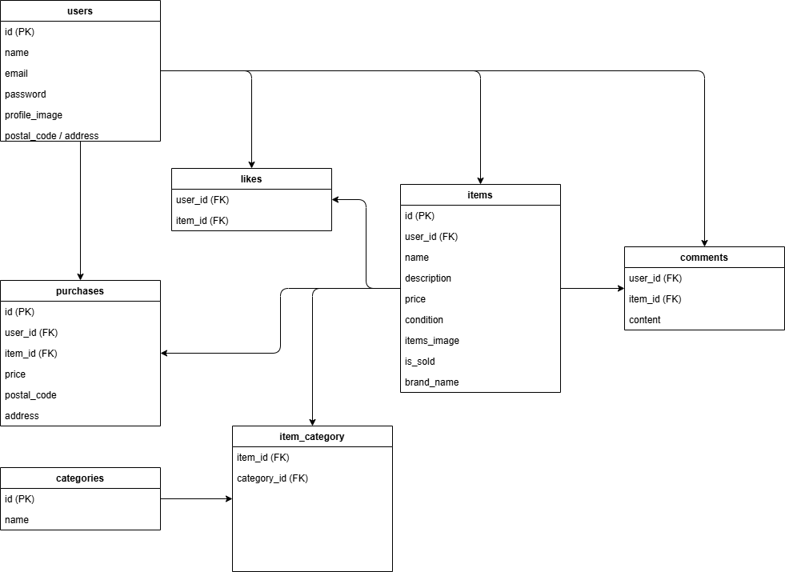

# coachtechフリマ

## 概要
模擬案件のフリマアプリです。

## 環境構築

### Dockerビルド
```bash
git clone https://github.com/phantom529/test_flea-market.git
cd test_flea-market
docker-compose up -d --build
```

### Laravel環境構築
```bash
docker-compose exec php bash
composer install
cp .env.example .env
php artisan key:generate
php artisan migrate:fresh --seed
php artisan storage:link
```

## 開発環境URL
- アプリ：http://localhost/
- ユーザー登録：http://localhost/register
- phpMyAdmin：http://localhost:8080
- MailHog：http://localhost:8025

## 使用技術（実行環境）
- PHP 8.2.11
- Laravel 8.83.8
- MySQL 8.0.26
- nginx 1.21.1
- phpMyAdmin
- MailHog

## ER図



## URL一覧

| URL | 説明 |
|---|---|
| http://localhost | 商品一覧（トップ） |
| http://localhost/register | 会員登録 |
| http://localhost/login | ログイン |
| http://localhost/items/{id} | 商品詳細 |
| http://localhost/purchase/{id} | 商品購入 |
| http://localhost/sell | 商品出品 |
| http://localhost/mypage | マイページ |
| http://localhost/mypage/profile | プロフィール設定 |

## 備考

- メイクセットの商品画像について、元のS3画像（外出メイクアップセット.jpg）がアクセス拒否のため別の画像URLに差し替えています。
